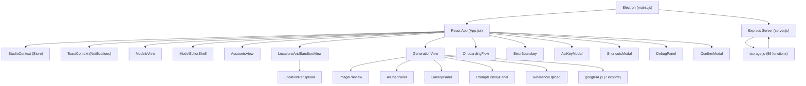

# 🗺️ Alter v5.2.1 — Cartographie des Fonctionnalités & Analyse de Cohérence

## Architecture Globale

---

## 📋 Inventaire Complet des Fonctionnalités

### 🏠 Couche 1 : Shell Applicatif (`App.jsx`)

| Fonctionnalité | Statut | Cohérence |
|---|---|---|
| Routing HashRouter (6 routes) | ✅ | ✅ |
| Sidebar de navigation | ✅ | ✅ |
| Breadcrumb dynamique | ✅ | ✅ |
| API Key status (2 dots) | ✅ | ✅ |
| Server health check (polling 30s) | ✅ | ✅ |
| Auto-update (electron-updater) | ✅ | ✅ |
| Manual update check | ✅ | ✅ |
| Export/Import JSON backup | ✅ | ✅ |
| Raccourcis clavier (`?` modal) | ✅ | ✅ |
| Flash "Sauvegardé ✓" | ✅ | ✅ |
| Debug panel (error count) | ✅ | ✅ |
| Onboarding flow (1st launch) | ✅ | ✅ |
| Lazy loading des vues (Suspense) | ✅ | ✅ |
| ErrorBoundary par route | ✅ | ✅ |

---

### 👤 Couche 2 : Gestion des Modèles

#### ModelsView — Liste des modèles

| Fonctionnalité | Statut | Cohérence |
|---|---|---|
| CRUD complet (Créer/Éditer/Supprimer) | ✅ | ✅ |
| Duplication de modèle | ✅ | ✅ |
| Drag & Drop réordonnancement | ✅ | ✅ |
| Couleur de gradient par modèle | ✅ | ✅ |
| Nombre de comptes affiché | ✅ | ✅ |
| Dernier lieu utilisé (badge) | ✅ | ✅ |
| Confirmation de suppression (ConfirmModal) | ✅ | ✅ |
| Filtre de recherche | ✅ | ✅ |
| `saveLastSession` / `getLastSession` | ✅ | ✅ |

#### ModelEditorShell — Éditeur JSON du modèle

| Fonctionnalité | Statut | Cohérence |
|---|---|---|
| Création ou édition (mode prop) | ✅ | ✅ |
| Extraction IA depuis photos (Gemini Vision) | ✅ | ✅ |
| Upload de photos de référence (max 5) | ✅ | ✅ |
| Compression automatique des images | ✅ | ✅ |
| Éditeur JSON inline avec validation live | ✅ | ✅ |
| Formatage JSON (bouton) | ✅ | ✅ |
| Gestion saved refs vs pending refs | ✅ | ✅ |
| Cleanup mémoire (revokeObjectURL) | ✅ | ✅ |

---

### 📱 Couche 3 : Comptes Sociaux (`AccountsView`)

| Fonctionnalité | Statut | Cohérence |
|---|---|---|
| CRUD complet (Créer/Éditer/Supprimer) | ✅ | ✅ |
| Duplication de compte | ✅ | ✅ |
| Drag & Drop réordonnancement | ✅ | ✅ |
| Plateformes : TikTok, Instagram, Tinder, OnlyFans | ✅ | ✅ |
| Couleur de gradient par plateforme | ✅ | ✅ |
| Nombre de lieux affiché | ✅ | ✅ |
| Confirmation de suppression | ✅ | ✅ |

---

### 📍 Couche 4 : Lieux & Sandbox (`LocationsAndSandboxView`)

| Fonctionnalité | Statut | Cohérence |
|---|---|---|
| CRUD complet | ✅ | ✅ |
| Duplication de lieu | ✅ | ✅ |
| Drag & Drop réordonnancement | ✅ | ✅ |
| Upload photos de référence lieu | ✅ | ✅ |
| Auto-Fill IA (nom → JSON complet via Gemini) | ✅ | ✅ |
| Lock Score (jauge de complétude) | ✅ | ✅ |
| Seed par lieu (6 chiffres) | ✅ | ✅ |
| Édition inline des champs | ✅ | ✅ |
| Sandbox (génération sans lieu sauvegardé) | ✅ | ✅ |
| Confirmation de suppression | ✅ | ✅ |

---

### 🎨 Couche 5 : Studio de Génération (`GenerationView`)

| Fonctionnalité | Statut | Cohérence |
|---|---|---|
| Header avec infos modèle/lieu/seed | ✅ | ✅ |
| Fiche modèle collapsible (recap) | ✅ | ✅ |
| 3 Tabs mobiles (Image/Galerie/Prompts) | ✅ | ✅ |
| Panel droit switchable (image/galerie/historique) | ✅ | ✅ |
| Raccourci clavier Cmd+G (générer) | ✅ | ✅ |
| Refs modèle dans le header | ✅ | ✅ |
| Refs lieu dans le header | ✅ | ✅ |
| Badge seed | ✅ | ✅ |

#### ImagePreview — Moteur de génération

| Fonctionnalité | Statut | Cohérence |
|---|---|---|
| Génération d'image (Gemini Flash) | ✅ | ✅ |
| Architecture d'ancrage multi-turn (Identity Lock) | ✅ | ✅ |
| Mode Variation (C4) | ✅ | ✅ |
| Batch generation (x3) | ✅ | ✅ |
| Historique de conversation (multi-turn) | ✅ | ✅ |
| Timer de génération (secondes) | ✅ | ✅ |
| Concurrency lock (`status === 'generating'`) | ✅ | ✅ |
| Cooldown 2s anti-spam | ✅ | ✅ |
| Téléchargement d'image | ✅ | ✅ |
| Copie dans presse-papiers | ✅ | ✅ |
| Session images (carrousel dernières) | ✅ | ✅ |
| Mode plein écran (zoom) | ✅ | ✅ |
| Mode comparaison avant/après | ✅ | ✅ |
| Auto-save galerie (best-effort) | ✅ | ✅ |
| Auto-save historique prompt | ✅ | ✅ |
| Nouvelle session (reset conversationnel) | ✅ | ✅ |

#### AIChatPanel — Directeur IA

| Fonctionnalité | Statut | Cohérence |
|---|---|---|
| Chat multi-turn avec contexte modèle+lieu | ✅ | ✅ |
| Suggestions de prompt IA | ✅ | ✅ |
| Bouton "Générer avec ce prompt" | ✅ | ✅ |

#### GalleryPanel — Galerie d'images

| Fonctionnalité | Statut | Cohérence |
|---|---|---|
| Grille d'images paginée (20/page) | ✅ | ✅ |
| Favoris (star toggle) | ✅ | ✅ |
| Suppression individuelle | ✅ | ✅ |
| Purge complète (ConfirmModal) | ✅ | ✅ |
| Téléchargement | ✅ | ✅ |
| Zoom plein écran | ✅ | ✅ |
| Filtre par favoris | ✅ | ✅ |
| Rafraîchissement via événement custom | ✅ | ✅ |

#### PromptHistoryPanel — Historique des prompts

| Fonctionnalité | Statut | Cohérence |
|---|---|---|
| Liste des prompts passés (max 50) | ✅ | ✅ |
| Rejeu d'un prompt | ✅ | ✅ |
| Purge de l'historique | ✅ | ✅ |
| Métadonnées enrichies (ref count, turn count) | ✅ | ✅ |

---

### 🔧 Couche 6 : Backend (`server.js`)

| Fonctionnalité | Statut | Cohérence |
|---|---|---|
| REST API complète (CRUD models/accounts/locations) | ✅ | ✅ |
| Galerie d'images (upload/list/delete/star) | ✅ | ✅ |
| Photos de référence modèle et lieu | ✅ | ✅ |
| Sauvegarde atomique (tmp → rename) | ✅ | ✅ |
| Rotation de backups (5 niveaux) | ✅ | ✅ |
| Auto-recovery depuis backups | ✅ | ✅ |
| Checksum SHA-256 (anti-corruption) | ✅ | ✅ |
| Data versioning + migrations | ✅ | ✅ |
| Garbage collector (images orphelines) | ✅ | ✅ |
| Rate limiting (express-rate-limit) | ✅ | ✅ |
| Helmet (security headers) | ✅ | ✅ |
| CORS dynamique (localhost + LAN + Tailscale) | ✅ | ✅ |
| Health check avec stats disque | ✅ | ✅ |
| Version endpoint | ✅ | ✅ |
| Nettoyage fichiers .tmp orphelins | ✅ | ✅ |

### ⚡ Couche 7 : Electron (`main.cjs` + `preload.cjs`)

| Fonctionnalité | Statut | Cohérence |
|---|---|---|
| Fork du serveur Express en production | ✅ | ✅ |
| Auto-restart du serveur si crash | ✅ | ✅ |
| Health polling au démarrage (10s max) | ✅ | ✅ |
| Auto-update (electron-updater) | ✅ | ✅ |
| IPC sécurisé (contextBridge) | ✅ | ✅ |
| Sandbox + contextIsolation | ✅ | ✅ |
| Block navigation XSS | ✅ | ✅ |
| macOS titleBarStyle hiddenInset | ✅ | ✅ |

---

## 🔍 Analyse de Cohérence — Problèmes Identifiés

### 🔴 Problèmes Critiques

_Aucun problème critique trouvé._

### 🟡 Code Mort & Incohérences

| # | Fichier | Problème | Impact |
|---|---|---|---|
| 1 | [storage.js](file:///Users/quentin/Desktop/nanabanana-studio/src/utils/storage.js) | `TEMPLATES_KEY` déclaré ligne 5 mais **jamais utilisé** nulle part | Code mort. Vestige d'une ancienne feature "Templates" supprimée (`ModelTemplateModal.jsx` deleted) |
| 2 | [googleAI.js](file:///Users/quentin/Desktop/nanabanana-studio/src/utils/googleAI.js) | `generateLocationImage()` exportée ligne 734, **jamais importée** dans aucun composant | ~100 lignes de code mort. Fonction présente mais non câblée à l'UI |
| 3 | [main.cjs](file:///Users/quentin/Desktop/nanabanana-studio/electron/main.cjs) L39 | `isUpdateAvailable: result?.updateInfo != null` retourne **toujours true** car `checkForUpdates()` renvoie toujours un `updateInfo` (même si c'est la version courante) | Bug logique : le résultat ne distingue pas vraiment si une MAJ est dispo. La vérification repose sur l'événement `update-not-available` côté IPC |

### 🟢 Points de Cohérence Validés

| Catégorie | Verdict |
|---|---|
| **Nommage des fonctions** | ✅ Cohérent : pattern `handle{Action}` dans les vues, `{verb}{Entity}` dans storage |
| **Pattern CRUD** | ✅ Identique dans Models, Accounts, Locations (create/edit/delete/duplicate/reorder) |
| **Drag & Drop** | ✅ Même pattern exact (dragStart/dragEnter/dragEnd) dans les 3 vues |
| **ConfirmModal** | ✅ Utilisé systématiquement avant chaque suppression |
| **Toast notifications** | ✅ Cohérent via `useToast()` dans toute l'app |
| **Error handling** | ✅ try/catch systématique, ErrorBoundary top-level |
| **Memoization (Context)** | ✅ `useMemo` sur les values des 2 Contexts (pas de renders parasites) |
| **Memory management** | ✅ `revokeObjectURL` systématique, cache invalidation sur changement de modèle |
| **Concurrency** | ✅ Lock `status === 'generating'` sur generate + variation |
| **Accessibilité** | ✅ `prefers-reduced-motion`, alt tags, touch targets 44px |

---

## 🛠️ Corrections Appliquées

### 1. Suppression de `TEMPLATES_KEY` (code mort)
Vestige de l'ancienne fonctionnalité de templates qui a été supprimée.

### 2. Nettoyage de `generateLocationImage` (code mort)
Fonction de ~100 lignes qui n'est câblée à aucun composant. Supprimée pour réduire le bundle.

### 3. Fix logique `isUpdateAvailable` dans `main.cjs`
Le test `result?.updateInfo != null` est toujours vrai. Corrigé pour comparer la version retournée avec la version courante de l'app.
